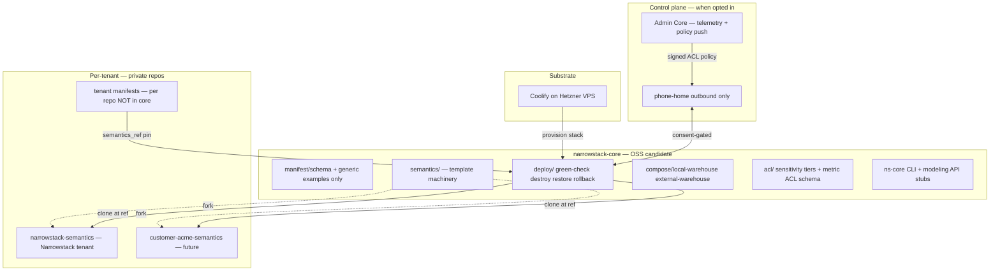
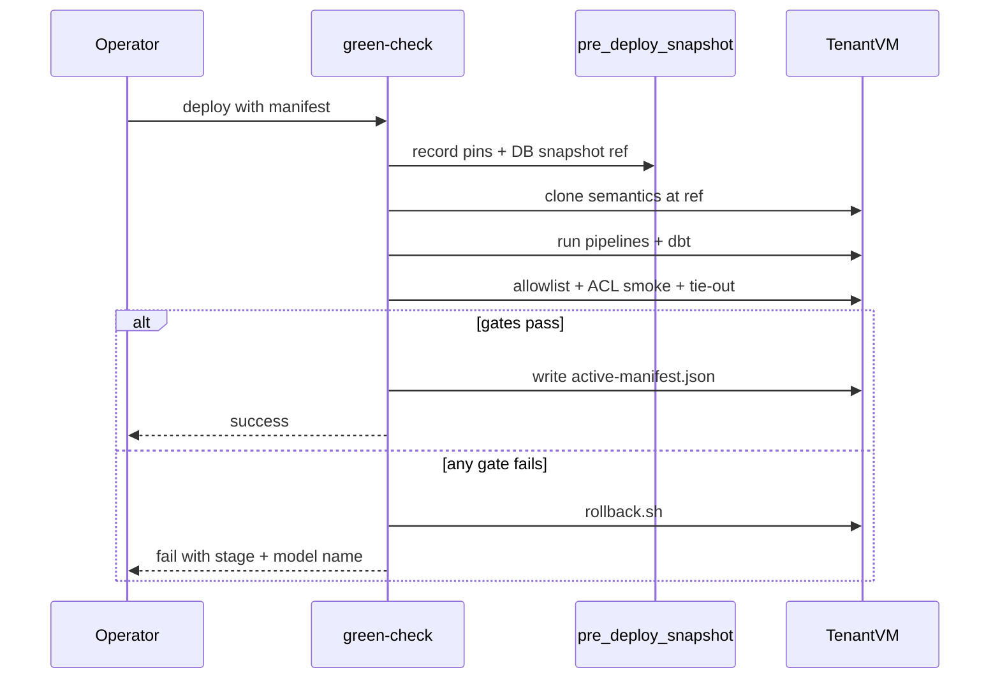
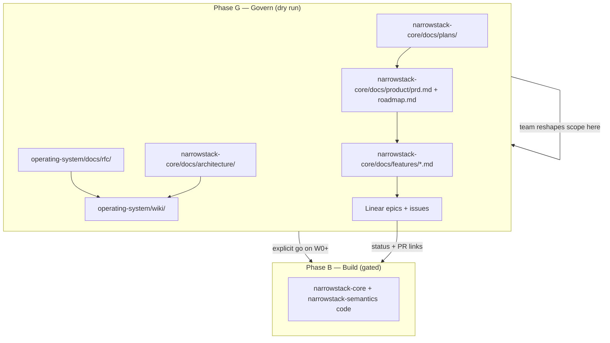

# narrowstack-core + narrowstack-semantics — architecture spec

**Executive summary:** `narrowstack-core` is the provisioning and runtime shell — IaC, compose, deploy gates, in-repo semantics templates, and ACL machinery. Each tenant's proprietary pipelines, models, and metrics live in a **separate private semantics repo**, pinned at deploy time via `manifest.semantics_ref`. Headless access (modeling API + `ns-core` CLI) is the v1 product surface; `narrowstack-core-app` is deprecated. One VM per customer (ADR-003). Coolify on Hetzner VPS is the substrate.

**Execution model:** This spec is a **dry-run blueprint**, not a build commitment. Phase **G (Govern)** lands first — all docs, PRD, feature specs, RFCs, roadmap, and Linear population — with **zero implementation**. That composite becomes the governing system; team discussion and customer priority can reshape scope before Phase **B (Build)** opens.

---

## System architecture



### Repo roles

| Artifact | Where | OSS? |
|---|---|---|
| Deploy scripts, compose, manifest **schema**, ACL framework | `narrowstack-core` | Yes |
| Semantics **templates** (patterns, one example vertical slice) | `narrowstack-core/semantics/` | Yes |
| Generic example manifest | `narrowstack-core/manifest/examples/example-local-warehouse.yaml` | Yes |
| Tenant-specific manifest | Private semantics repo `deploy/manifest.yaml` | No |
| Proprietary pipelines, models, metrics | Private semantics repo per tenant | No |

Core is the public boilerplate. A manifest naming NS-specific pipelines, vault items, and principals is **tenant configuration** — it belongs in the private semantics repo, never in core.

### Semantics delivery model

At deploy time, `green-check.sh` clones the private semantics repo at the pinned `semantics_ref` (git tag/SHA). Rollback = revert ref + re-run green-check.

**v1:** git clone at pinned ref (config-commit model; lowest build cost).

**v2 (deferred):** signed OCI artifact / immutable bundle produced by semantics CI — evaluate after fleet scale warrants it.

### Tenant semantics repo ownership

| Model | When |
|---|---|
| **Narrowstack-owned private repo per tenant** (`customer-{slug}-semantics`) | Default MSP — IP retention, uniform fleet upgrades |
| **Customer-owned repo** | Enterprise / compliance exception |
| **Per-customer git org for all source** | Not recommended at MVP |

Only the **semantics fork** is per-tenant. Core boilerplate stays in `Narrowstack/narrowstack-core`.

### Proprietary yet futureproof semantics

- **Template** in OSS `narrowstack-core/semantics/` — patterns only, no NS payroll/bonus/company-split.
- **Fork** per tenant in private repo; `semantics_ref` pin is the contract.
- **Semver tags** on semantics releases; manifest records `semantics_template_version` for fork drift.
- **Allowlist + ACL** enforce what can ship; CI default-deny.
- **License** on template; no proprietary models in OSS tree.

---

## Deploy models

Deploy shape is expressed in the instance manifest — not via topology enums. Use `warehouse.mode`:

| Business term | `warehouse.mode` | What deploys |
|---|---|---|
| Full Core instance | `local` | Postgres + ingestion + transform + semantic layer + agent API on VM |
| Semantic layer attach | `external` | Transform + semantic layer + agent API against customer warehouse |

Compose paths: `compose/local-warehouse/` and `compose/external-warehouse/`. Conceptual names ("full instance", "semantic layer attach") live in documentation only.

### `tenant_id`

Stable slug identifying **one Core instance** (one data plane). Used for op vault item naming, Compose/Coolify labels, audit partition, and ACL principal namespace. Examples: `example` (demo), `narrowstack` (NS internal), `acme` (future customer). Not a git repo name — a runtime identity.

---

## Warehouse contract

Core specifies the warehouse as an **interface**, not a specific engine implementation.

```yaml
warehouse:
  mode: local | external
  provider: postgres          # default v1; snowflake | clickhouse = deferred adapter profiles
  service: postgres           # when mode=local
  volume: pgdata
  external_dsn_ref: op://...  # when mode=external
  backup: { ... }             # required when mode=local
```

| Engine | v1 posture |
|---|---|
| **Postgres (self-hosted on VM)** | Default — `warehouse.mode: local` |
| **Supabase / managed Postgres** | Valid external target via DSN attach |
| **Snowflake / ClickHouse** | Legacy client-delivery exceptions; adapter profile deferred (W6+) |
| **Shared multi-tenant warehouse** | Out of scope (ADR-003) |

---

## Instance manifest (minimum fields)

| Field | Required | Notes |
|---|---|---|
| `tenant_id` | yes | Stable slug |
| `warehouse` | yes | `mode: local \| external`; see above |
| `vm_size_class` | local only | Cloud sizing token |
| `semantics_ref` | yes | Git ref of tenant semantics repo |
| `enabled_pipelines` | yes | Subset of dlt sources |
| `allowlist_profile` | yes | e.g. `default`, `internal` |
| `principals` | yes | ACL principals + metric allow-lists |
| `control_plane` | no | Phone-home + remote ACL when enabled |
| `provider_mode` | yes | M0–M3 per provider spec |
| `telemetry_grants` | yes | Default `[]` (heartbeat only) |
| `backup` | local only | Target + retention via `op://` |
| `volume_ceiling_gb` | no | Full-refresh limit documentation |

Generic example: `manifest/examples/example-local-warehouse.yaml` (in core). NS tenant manifest: `narrowstack-semantics/deploy/manifest.yaml` (private).

---

## Deploy pipeline

### Green-check sequence

1. `pre-deploy-snapshot.sh` — record active pins, manifest hash, optional pg_dump ref
2. Clone semantics at `semantics_ref`
3. Run enabled pipelines → `dbt seed && dbt run && dbt parse`
4. Allowlist gate — fail with model name on violation
5. ACL smoke — each principal sees only permitted metrics
6. Tie-out validators for shipped metrics
7. Smoke `mf query`
8. On success: write `active-manifest.json` on VM
9. On failure: `rollback.sh` (auto unless `--no-auto-rollback`)



### Rollback and restore

| Script | Purpose |
|---|---|
| `deploy/pre-deploy-snapshot.sh` | Persist `core_ref`, `semantics_ref`, manifest hash, optional pg_dump |
| `deploy/rollback.sh` | Restore previous pins; re-run green-check or DB restore |
| `deploy/destroy.sh` | Stop compose; optional volume wipe per manifest flag |
| `deploy/restore.sh` | Pull backup; replay green-check steps 3–7 |
| `deploy/active-manifest.json` | On-VM SSOT of live state (not in git) |

**Data on both sides:** pre-transform snapshot or full-refresh boundary; post-transform pg_dump (local warehouse) or semantics-tag revert (external — customer data stays put). Rollback is the restore path, not a second mechanism.

**Fleet upgrades:** proposed to instance, not pushed. Every upgrade runs the same green-check on that customer's data. Three versioned interfaces move independently: tool contract, semantic contract, telemetry protocol.

### Semantics update redeploy

1. Change lands in private semantics repo → CI (allowlist + dbt parse + ACL regression)
2. Tag release (e.g. `v0.5.1`)
3. Bump `semantics_ref` in tenant manifest
4. `op run --env-file=.env.tpl -- ./deploy/green-check.sh <tenant-manifest>`
5. Rollback: revert `semantics_ref` to prior tag; re-run green-check

---

## Access control

Three enforcement layers — all required:

| Layer | Mechanism | Enforced by |
|---|---|---|
| **Warehouse** | Per-role Postgres users; row/column grants | Provision script + compose init SQL |
| **Semantic** | Metric `meta.sensitivity_tier` + profile allowlist | `check-allowlist.py` + MetricFlow filter |
| **API** | Principal token → allowed metric names; `list_metrics` redacts | Modeling API token table; ACL smoke in green-check |

```yaml
tenant_id: narrowstack
semantics_ref: "github.com/Narrowstack/narrowstack-semantics@v0.5.0"
allowlist_profile: internal
principals:
  - id: leadership-trio
    tier: leadership
    metrics: ["*"]
  - id: team-pulse
    tier: team
    metrics: ["revenue_*", "pipeline_*", "delivery_health_*"]
  - id: agent-bounded
    tier: agent
    metrics: ["revenue_total", "cash_balance"]
```

### Remote ACL updates (phone-home, when enabled)

```yaml
control_plane:
  enabled: false
  phone_home_grants: []   # heartbeat, operational_health, metric_telemetry, support_access
acl_policy:
  source: local           # local | phone_home
  policy_ref: null        # op:// or signed bundle when phone_home
```

- Outbound-only; customer initiates (per telemetry protocol).
- ACL policy push requires explicit consent grant.
- **Local kill-switch overrides** any remote update.
- Super-admin changes: signed, audited, append-only on VM log.
- `deploy/acl-apply.sh` in core; full receiver in Admin plane.

Per-role warehouse credentials (dlt, dbt, MetricFlow, app reader, agent) via `.env.tpl` + `op://` — never a shared warehouse password.

---

## Headless operations

| Surface | Scope | Wave |
|---|---|---|
| **`ns-core` CLI** (on VM) | `status`, `deploy`, `rollback`, `grants`, `acl list`, `backup`, `restore` | W2 stubs; W4 functional |
| **Modeling API** | `list_metrics`, `get_manifest`, `mf_query` | W5–W6 |
| **Remote management** | Phone-home pull or support-access reverse tunnel | W3 interface; Admin implements |

Internal Narrowstack control surface (when customer opts in) consumes the same API — not a second contract.

`narrowstack-core-app` is **deprecated**. No `app_ref` in manifest. Compose drops chat GUI until a future UI layer exists.

---

## semantics/ template tree (in core)

OSS-safe template machinery at `narrowstack-core/semantics/`:

- `requirements.txt`, `dlt_pipelines/_template_pipeline.py`, `example_rest_pipeline.py`
- `dbt_project/` — layer config, profiles, macros, MetricFlow time spine
- One vertical slice: staging → mart → `sem_*` + one metric
- `allowlist/default.yaml`, `scripts/check-allowlist.py`
- `acl/metric-sensitivity.yaml`, `scripts/smoke_test.py`
- `.github/workflows/` — allowlist + ACL regression + `dbt parse`

**Stays only in private tenant repo** (`narrowstack-semantics` and future customer forks):

- Live connectors, bonus/payroll, company-split, NS-specific seeds, full dashboard layer
- `allowlist/internal.yaml`, `deploy/manifest.yaml`, NS principal definitions

---

## Legacy client validation (deferred)

Narrowstack operates **seven bespoke data implementations** across live customer sites today — predominantly Airbyte + dbt + Postgres (with Snowflake/ClickHouse exceptions). These are **not** the dogfood Core stack and are **not** in scope for v1 boilerplate implementation.

**Intent (document now; execute after NS instance proves green):**

Probe each existing implementation and produce a **sufficiency assessment** — would this Core + semantics architecture meet their needs if they migrated? Full migration is not assumed; the goal is evidence, not commitment.

| Phase | Activity | Outcome |
|---|---|---|
| **Inventory** | Per-customer: ingestion tool, warehouse engine, transform layer, semantic exposure, access model | `docs/product/research/legacy-client-inventory-YYYYMMDD.md` |
| **Gap matrix** | Map each site against Core manifest capabilities (warehouse mode, pipelines, ACL, volume) | Gaps ranked: blocker / workaround / out-of-scope |
| **Fit probe** | For 1–2 representative sites, model what their manifest + semantics fork would look like | Confirms or refutes sufficiency without touching production |
| **Verdict** | Per customer: migrate / coexist / retain bespoke | Feeds commercial and engineering roadmap; no auto-migration |

Track as a **deferred Linear epic** linked to NS-2 Core project. Spec-only in Phase G; research in Phase B after W4 gate passes.

---

## Governing system (scope control)

Phase G produces a **composite control plane** — no code required. Agents and humans execute against this stack; reshaping one layer does not orphan the others.



| Layer | Home | Role |
|---|---|---|
| **Architecture spec** | `narrowstack-core/docs/plans/` | Target end-state; revised without code churn |
| **PRD + roadmap** | `narrowstack-core/docs/product/` | Walking skeleton, MoSCoW, TASK-NNN execution queue |
| **Feature specs** | `narrowstack-core/docs/features/` | Per-capability contract before any build task |
| **RFCs** | `operating-system/docs/rfc/` | One-way-door decisions debated before canon |
| **Wiki + working docs** | `operating-system/wiki/`, `working/` | Strategy canon; pointers, not duplicate status |
| **Linear** | NS-2 Core + Cloud projects | **Only** work tracker; epics mirror roadmap phases |

**Gate to Phase B:** Operator signs off governing stack complete (PRD, all Phase G feature specs, RFCs published or explicitly deferred, Linear epics populated, roadmap TASK-NNN ready). Waves W0–W6 are **proposed** until then — reorder, defer, or cut without sunk build cost.

---

## Repo structure

```
narrowstack-core/
├── README.md
├── AGENTS.md
├── docs/
│   ├── architecture/overview.md
│   ├── guides/          # deploy, rollback, warehouse, operations
│   ├── plans/           # this spec
│   └── product/research/  # architecture critique, legacy client inventory
├── semantics/           # template machinery
├── acl/                 # framework-level ACL schema
├── manifest/
│   ├── schema.json
│   └── examples/
├── deploy/
│   ├── green-check.sh
│   ├── pre-deploy-snapshot.sh
│   ├── rollback.sh
│   ├── allowlist-gate.sh
│   ├── acl-smoke.sh
│   ├── acl-apply.sh
│   ├── destroy.sh
│   └── restore.sh
├── compose/
│   ├── local-warehouse/
│   └── external-warehouse/
├── scripts/
│   ├── lint-manifest.mjs
│   └── clone-semantics.sh
└── .github/workflows/ci.yml
```

---

## Documentation corpus (Phase G — all before build)

Agents and operators need authoritative docs **in the repo they execute against**. OS wiki remains strategy canon; narrowstack-core gets working copies with `verified:` stamps and one-line wiki backlinks. **Every row below completes in Phase G** — no implementation wave may start until its doc row is done.

| Priority | Source (OS wiki / working) | Target (narrowstack-core) | Skill | Phase G step |
|---|---|---|---|---|
| 1 | This plan | `docs/plans/narrowstack-core-architecture-20260831.md` | `visual-plan` | G0 — ratify architecture |
| 2 | `working/core-prd.md` | `docs/product/prd.md` | `app-prd` | G1 — PRD + appetite |
| 2 | — | `docs/product/roadmap.md` (TASK-NNN, all phases proposed) | `app-prd` | G1 — roadmap from PRD |
| 3 | Architecture critique topics | `docs/product/research/core-architecture-critique-YYYYMMDD/review.md` | `architecture-decision` + `deep-research` | G2 |
| 4 | `working/core-packaging-spec.md` | `docs/architecture/packaging.md` | `docs-gardener` | G3 |
| 4 | `working/core-telemetry-protocol.md` | `docs/architecture/telemetry-protocol.md` | `docs-gardener` | G3 |
| 4 | `wiki/product/charters/ns-2-core.md` | `docs/architecture/charter-summary.md` | `docs-gardener` | G3 |
| 4 | ADR-001, ADR-003 | `docs/architecture/decisions.md` | `docs-gardener` | G3 |
| 4 | — | `docs/architecture/overview.md` | `docs-gardener` | G3 |
| 5 | Each major capability (see table below) | `docs/features/<slug>.md` | `app-feature` | G4 — one spec per capability |
| 6 | Deferred legacy validation | `docs/features/legacy-client-fit.md` | `app-feature` | G4 — spec only, build deferred |
| 7 | One-way doors (see RFC table) | `operating-system/docs/rfc/rfc-NNN-*.md` | `architecture-decision` | G5 — publish or defer with reason |
| 8 | Wiki pointer updates | `ns-2-core.md`, `modules/core.md`, component boundaries | `docs-gardener` | G6 — backlinks to repo + Linear |
| 9 | — | Linear epics + issues (from roadmap + feature specs) | operator + agent | G7 — populate Linear |

**Guides** (`docs/guides/deploy.md`, rollback, warehouse, operations) — authored in Phase G as **skeletons** from feature specs (sections + acceptance criteria), filled during Phase B when code exists.

**narrowstack-semantics:** operator + allowlist guides specced in G4 (`semantics-template-cut.md`); repo edits wait for Phase B / W3.

Rule: one fact, one home. Repo docs link to wiki for strategy; wiki gets `**Repo:** Narrowstack/narrowstack-core` and `**Linear:**` project links.

### Phase G — feature specs (`app-feature`, all before build)

| Priority | Capability | Feature spec | RFC needed? |
|---|---|---|---|
| P0 | Instance manifest + schema | `docs/features/instance-manifest.md` | Maybe — wire format |
| P0 | Model-shipping allowlist | `docs/features/allowlist-gate.md` | No |
| P0 | Rollback-first deploy | `docs/features/rollback-deploy.md` | No |
| P0 | Three-layer metric ACL | `docs/features/metric-acl.md` | Yes — ACL + phone-home push |
| P1 | Local-warehouse compose + green-check | `docs/features/local-warehouse-deploy.md` | No |
| P1 | `ns-core` CLI surface | `docs/features/ns-core-cli.md` | No |
| P1 | Semantics template extraction | `docs/features/semantics-template-cut.md` | Yes — clone vs artifact delivery |
| P2 | Modeling API (headless) | `docs/features/modeling-api.md` | No — extends agent-tool-contract proposal |
| P3 | Legacy client sufficiency probe | `docs/features/legacy-client-fit.md` | No — research spec only |

Each `app-feature` run appends its roadmap phase to `docs/product/roadmap.md`. **No `build-loop` until Phase G complete.**

### Phase G — RFCs (`architecture-decision`)

| RFC topic | Question | Promote to ADR when accepted |
|---|---|---|
| Semantics delivery | Git clone at deploy vs signed artifact bundle | After G2 critique + team sign-off |
| Metric ACL + remote policy | Three-layer model; phone-home ACL push grant | Before W1 build |
| Semantics repo ownership | Narrowstack-owned default vs customer-owned | Before W3 build |
| Headless surface | Deprecate core-app; modeling API as v1 product surface | G1 PRD non-goals |
| OS-338 split | Dogfood dlt path vs Airbyte client-delivery demo | G7 Linear reconcile |

RFCs live in `operating-system/docs/rfc/`; accepted decisions promote to ADR or update existing ADR-001/003 paperwork.

---

## Implementation waves (proposed — Phase B, gated)

Waves are **placeholders** until Phase G governing stack is signed off. Team may reorder, defer, or cut waves without build sunk cost.

| Wave | Deliverable (Phase B) | Linear epic (populated in G7) |
|---|---|---|
| **W0** | Scaffold, schema, `semantics/` templates, example manifest, ACL stubs, CI | OS-### W0 |
| **W1** | Allowlist + ACL schema; rollback scripts; deploy guides finalized | OS-### W1 |
| **W2** | `compose/local-warehouse/` on Coolify; green-check green; `ns-core` CLI stubs | OS-### W2 + Cloud deps |
| **W3** | `narrowstack-semantics` refactor; private tenant manifest | OS-### W3 |
| **W4** | First NS tenant — PRD skeleton steps 1–10 | OS-### W4 |
| **W5** | Full NS pipelines; instance #2 self-host; modeling API slice | OS-### W5 |
| **W6** | External warehouse compose; legacy client research; fleet upgrade doc | OS-### W6 (deferred) |

After each build wave: frontier review → `docs/reviews/wave-N-YYYYMMDD.md` → `visual-recap`.

---

## Agent execution plan

Skills run in pipeline order. User research skills are **out of scope**. **`build-loop` does not start until Phase G is complete and operator opens Phase B.**

### Phase G — Govern (dry run, docs + specs + Linear + RFCs only)

| Step | ID | Skill(s) | Output | Gate |
|---|---|---|---|---|
| Ratify architecture spec | G0 | `visual-plan` | This plan committed to `docs/plans/` | Operator |
| PRD + full roadmap | G1 | `app-prd` | `docs/product/prd.md`, `docs/product/roadmap.md` (all TASK-NNN proposed) | Human — appetite, non-goals |
| Architecture critique | G2 | `architecture-decision` + `deep-research` | `docs/product/research/core-architecture-critique-YYYYMMDD/` | Publish before feature specs |
| Architecture doc corpus | G3 | `docs-gardener` | packaging, telemetry, charter-summary, decisions index, overview | — |
| All feature specs | G4 | `app-feature` (×9 capabilities) | `docs/features/*.md` + roadmap phases appended | Human on ACL cut, semantics cut |
| RFCs for one-way doors | G5 | `architecture-decision` | `operating-system/docs/rfc/rfc-NNN-*.md` | Human accept → ADR |
| Wiki backlinks | G6 | `docs-gardener` | OS wiki pointers to repo + Linear | — |
| Populate Linear | G7 | operator (+ agent drafts) | Epics W0–W6, issues from roadmap + specs, OS-338 split | Operator |
| **Phase G sign-off** | G8 | — | Governing stack complete; Phase B authorized (optional: start at Wx not W0) | **Operator** |

**Phase G deliverable:** reshapable scope — team and customer priority can reorder/defer Linear epics and roadmap phases **without** abandoning partial implementation.

### Phase B — Build (gated; per authorized wave)

| Step | Skill | When |
|---|---|---|
| Execute roadmap tasks | `build-loop` | Only after G8; one wave at a time |
| Deploy/rollback quality bar | `gauntlet-loop` (gate mode) | W1–W2 |
| Semantics proprietary cut | `brownfield-migrate` | W3 |
| Coolify/Hetzner provision | `remote-deploy` | W2, W4 |
| Security on auth/secrets | `review-security` | W1, W4 |
| Code review | `review-bugbot` | Each PR |
| Frontier wave review | frontier pass | End of each wave |
| Wave recap | `visual-recap` | End of each wave |
| Wiki delta (factual updates only) | `docs-gardener` | When build changes reality |

### Deferred track (spec in G4; research in B/W6)

| Step | Skill | When |
|---|---|---|
| Legacy client inventory | `deep-research` | Phase B / W6 only |
| Per-site fit probe | `brownfield-migrate` | After W4 gate |

---

## Linear — gap analysis and sync

### Current state (queried 2026-08-31)

| Linear artifact | Status | Gap vs this architecture |
|---|---|---|
| **Narrowstack Core (Stackflow)** project | Backlog / Later; lead Max | Tracks **Airbyte client-delivery** connector backlog (NRWSTK-595 subtree, custom connectors). Does **not** track dlt dogfood, `narrowstack-core` IaC, allowlist, or ACL. NS-2 charter links here — **misaligned**. |
| **OS-338** (Core MVP demo) | To-do, Urgent | Specs Airbyte → dbt → Postgres → Metabase demo. **Conflicts** with headless dlt + MetricFlow architecture. Child OS-339, OS-341. |
| **Narrowstack Cloud** project | Active (NRWSTK-900+ done) | VM automation exists; **hcloud refactor** (NRWSTK-901–909) still Triage per OS wiki. NRWSTK-911 click-to-deploy, NRWSTK-945 core webapp (chat GUI — **deprecated** by D8). |
| **Phone-home / telemetry** | No Linear project | Spec exists in OS working docs only |
| **Allowlist / model-shipping gate** | No issues | Critical blocker in packaging spec — untracked |
| **`narrowstack-core` repo IaC** | No issues | Greenfield; only plan doc on branch |
| **NRWSTK-1261** Core Bridge Spike | To-do (microsite) | Stackmap → Airbyte/dlt bridge — related but separate; keep linked, not merged |

### Incorporate from Linear into this plan

| Linear item | Action in architecture |
|---|---|
| OS-338 / OS-339 / OS-341 | **Split track:** mark demo issues as "client-delivery / Airbyte" OR rewrite acceptance to headless Core PRD skeleton. Do not let OS-338 drive `narrowstack-core` IaC scope. |
| NRWSTK-901–909 (hcloud) | W2 dependency — Cloud provisions VM; core consumes via manifest. Link W2 primary to Cloud sub-tickets. |
| NRWSTK-911, NRWSTK-915 | Cloud customer-facing deploy/login — consumes core green-check output; not core repo work. |
| NRWSTK-945 (core webapp) | Cancel or reparent to deprecated `narrowstack-core-app`; replace with modeling API issue (W5). |
| NRWSTK-1261 (Core Bridge) | W6+ cross-cutting; reference in legacy validation / Stackmap section. |
| Stackflow connector backlog (NRWSTK-598+) | Move to **"Legacy client delivery"** label or child project — not dogfood Core |

### Push from this plan into Linear

**Populate in Phase G7** — issues describe spec acceptance criteria, not implementation steps. Phase B PRs link back.

**Recommended structure** (create during G7, refine before G8):

```text
Project: Narrowstack Core (retarget Stackflow project OR new OS project)
  ├── Epic: G — Govern (dry run) [In Progress until G8]
  ├── Epic: W0 — Repo scaffold [Backlog until G8]
  ├── Epic: W1 — Allowlist + ACL + rollback
  ├── Epic: W2 — Local-warehouse compose + green-check
  ├── Epic: W3 — Semantics refactor + private tenant manifest
  ├── Epic: W4 — NS instance (PRD skeleton)
  ├── Epic: W5 — Full pipelines + modeling API
  └── Epic: W6 — External warehouse + legacy client fit [deferred]

Project: Narrowstack Cloud (existing)
  └── W2/W4 blocked-by NRWSTK-901–909
```

**Issue creation checklist** (one primary + sub-tickets per NRWSTK pattern where non-trivial):

| New issue | Team | Maps to |
|---|---|---|
| Core IaC — instance manifest schema + examples | OS | W0 |
| Core — model-shipping allowlist (default-deny) | OS | W1 |
| Core — three-layer metric ACL framework | OS | W1 |
| Core — rollback-first deploy pipeline | OS | W1 |
| Core — local-warehouse compose on Coolify | OS | W2 |
| Core — NS tenant instance (second VM) | OS | W4 |
| Core — modeling API first slice | OS | W5 |
| Core — legacy client sufficiency assessment | OS | W6 deferred |
| Telemetry — phone-home protocol Linear project | OS | W3+ (Admin plane) |

**Reconcile OS-338:** Add comment linking new W4 epic as the dogfood path; either cancel Airbyte demo acceptance or open sibling issue "Client-delivery demo (Airbyte)" under engagements — two builds, one product name.

### Linear workflow conventions

- PR title: `OS-###: feat: <summary>` (or NRWSTK if engagements-owned Cloud work)
- Branch: `feat/OS-###-short-slug`
- PR body: `fixes OS-###` for primaries; sub-ticket checklist for scope
- Cloud agent: `@cursor <task> [repo=Narrowstack/narrowstack-core] [branch=feat/OS-###-slug]`
- Status: primary In Progress on implementation start; In Review on PR; Done on merge

---

## Agent execution map (summary)

| Phase | Steps | Skills |
|---|---|---|
| **G — Govern** | G0–G8 | `visual-plan` → `app-prd` → `architecture-decision` + `deep-research` → `docs-gardener` → `app-feature` (×9) → RFCs → Linear G7 → **G8 sign-off** |
| **B — Build** | W0–W6 | `build-loop`, `gauntlet-loop`, `brownfield-migrate`, `remote-deploy`, reviews, `visual-recap` |

**Hard rule:** Phase B blocked until G8. Roadmap + Linear + RFCs + wiki are the governing system; reshape them freely in Phase G.

---

## Decisions

| # | Resolution |
|---|---|
| D1 | `semantics/` in core + `semantics_ref` for private implementations; tenant manifests not in core |
| D2 | Prove local warehouse first; external attach in W6 |
| D3 | Managed Postgres for instance #1; self-host instance #2 in W5 |
| D4 | `internal` profile for NS; skeleton uses `default` |
| D5 | Manifest git ref; no submodule |
| D6 | Three-layer ACL in boilerplate from W1 |
| D7 | Coolify on Hetzner VPS |
| D8 | Deprecate `narrowstack-core-app` for v1 headless Core |
| D9 | No topology enum — `warehouse.mode` only; deploy model names are docs-only |
| D10 | Default tenant semantics repos Narrowstack-owned |
| D11 | Rollback-first deploy — snapshot + auto-rollback in W1 |
| D12 | Legacy client sufficiency probe — spec in G4; research deferred to B/W6 |
| **D13** | **Govern before build** — Phase G (docs, PRD, feature specs, RFCs, Linear) completes and G8 sign-off before any `build-loop` |
| **D14** | Waves W0–W6 are **proposed** until G8; team may reorder/defer without build sunk cost |

---

## Non-goals

- `narrowstack-core-app` (deprecated)
- Tenant-specific manifests or proprietary refs in core
- Topology enum in manifest schema
- Per-customer git orgs at MVP
- Airbyte client-delivery stack in this repo
- Full migration of all seven legacy clients (probe only; migrate case-by-case)
- Snowflake/ClickHouse adapters in default boilerplate
- Shared multi-tenant warehouse (ADR-003)
- Feature flags on main
- **Implementation before Phase G8 sign-off**
