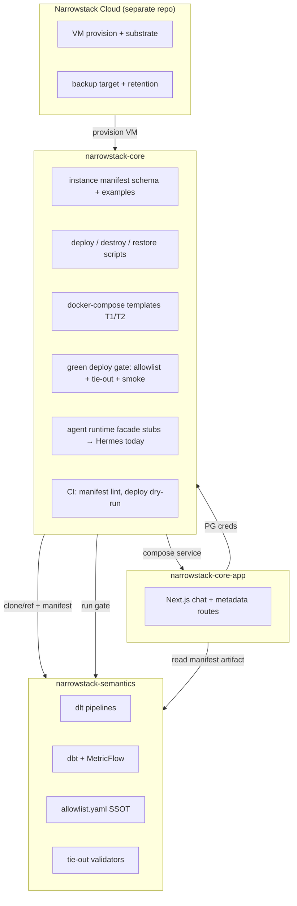
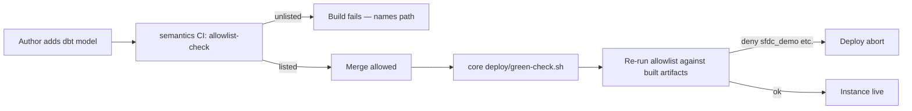

> **Superseded (2026-08-31)** — Canonical architecture:
> [`narrowstack-core-architecture-20260831.md`](./narrowstack-core-architecture-20260831.md).
> Retained for history only. Do not implement from this file — it predates headless v1
> (D8), `warehouse.mode` without topology enums (D9), and removal of `app_ref`.

# narrowstack-core — IaC + Core module implementation spec

**Executive summary:** The proposed Core architecture (dlt → Postgres → dbt → MetricFlow → bounded agent → chat, one VM per customer, IaC as the Cloud interface) is **sound for v1** if scoped to the PRD's thinnest end-to-end slice. `narrowstack-core` becomes the **provisioning + runtime shell**; `narrowstack-semantics` stays the **data contract SSOT** until a second instance exists; `narrowstack-core-app` stays the **chat GUI** with manifest consumed as a build artifact, not a committed copy. Ship Wave 0 (repo bootstrap + allowlist CI) before any customer-facing deploy. Do not four-repo split until the MVP skeleton passes acceptance criteria in `core-prd.md`.

---

## Architecture verdict (v1)

| Element | Verdict | Rationale |
|---|---|---|
| Six-layer stack topology | **Keep** | Live in `narrowstack-semantics`; topology is the product |
| ADR-003 per-customer VM | **Keep** | Removes multi-tenant warehouse problem from Core |
| Instance manifest as config commit | **Keep** | Already specified in packaging spec; honest first IaC |
| T1 + T2 topologies designed together | **Keep** | T2 is sold; forces semantic layer to be portable |
| Hermes + bounded-tool facade (ADR-001) | **Keep for v0** | Wire works; facade decouples GUI from Hermes |
| Five-noun entity model | **Keep as goal; scope v1 to one entity** | Full layer is a build, not a redesign — but skeleton needs one durable key |
| Model-shipping allowlist | **Keep; gate everything** | Sharpest blocker; default-deny before any external deploy |
| Four-repo split (`core-connectors`, etc.) | **Defer** | Packaging spec gate: second instance must exist first |
| Monolithic merge of semantics into core now | **Change** | Populate core as IaC/runtime shell; semantics stays separate with interfaces |
| Managed Supabase for dogfood warehouse | **Defer decision** | Customers get self-hosted Postgres on VM; dogfood can stay managed until restore drill |
| Full orchestrator / incremental dlt | **Defer** | Document volume ceiling in manifest; incremental is post-skeleton |
| Airbyte client-delivery "Core" | **Explicit non-goal for this repo** | Separate build; do not conflate in IaC or Linear tracking |

---

## Strengths (evidence-backed)

- **Working dogfood stack** — 14 dlt pipelines, full dbt/MetricFlow layer, Harvest revenue tie-out validated (`narrowstack-semantics/docs/VALIDATION.md`).
- **Clear module boundaries in wiki** — component boundary table names IaC as Core+Cloud interface, semantics as SSOT (`operating system/wiki/product/component-boundaries.md`).
- **Tenancy decided** — ADR-003 removes the hardest packaging problem (shared warehouse multi-tenancy).
- **Runtime decision closed** — ADR-001 keeps Hermes with facade path; no greenfield agent loop for v0.
- **Packaging spec is build-ready** — manual rebuild recipe in `core-architecture.md` maps 1:1 to automated steps; green deploy checklist is explicit.
- **T2 precedent de-risks T1** — semantic layer already sold against customer-owned warehouse; proves layer portability.
- **Coupling seams documented** — three parameterized seams in `narrowstack-core-app/ARCHITECTURE.md` (Hermes, Postgres, semantics mount).
- **Consolidation map drafted** — surviving repo roles named in `repo-consolidation.md`; name-squat flagged for resolution.

---

## Weaknesses / risks

| Risk | Severity | Evidence |
|---|---|---|
| No model-shipping allowlist | **Critical** | 15/31 dashboard tables carry internal bonus logic; 10 payroll + 6 company-split metrics in tree |
| No IaC anywhere | **High** | `narrowstack-semantics` has zero Terraform/Compose/CI; packaging spec is first packaging |
| Entity layer absent | **High** | Client/Person exist 3× unreconciled; engagement is hand-maintained seed |
| Manifest drift (core-app bundled copy) | **High** | Paired fix commits on both repos; consolidation doc flags SSOT violation |
| Single warehouse credential | **High** | One password backs dlt, dbt, MetricFlow, app, agent — bounded tools meaningless |
| Two "Core builds" conflated | **Medium** | Airbyte client-delivery vs dlt dogfood; Linear Stackflow tracks wrong build |
| Full-refresh-only ingestion | **Medium** | Reasonable at NS volume; unknown at customer scale |
| Count/manifest doc drift | **Low** | 44/31/20/55/31 vs stale ARCHITECTURE.md (5 connectors, 17 metrics) |
| ADR-001 status field "Proposed" | **Low** | Paperwork gap; decision treated as closed in packaging spec |
| Org auth blocks Tucker on GitHub | **Medium** | Known blocker for push/PR; operator must unblock |

---

## Recommendations on Phase 1 open decisions

### 1. Target repo topology

**Recommendation:** **Dual-repo v1** — `narrowstack-core` owns IaC, instance manifest schema, deploy/destroy scripts, runtime facade stubs, CI glue, and compose templates; `narrowstack-semantics` remains canonical data contract (pipelines, dbt, MetricFlow, allowlist definitions). `narrowstack-core-app` stays separate; core references it as a submodule or pinned git ref in compose until merge is warranted.

**Rationale:** Packaging spec explicitly gates four-repo split until second instance. Moving 14 pipelines + full dbt tree into an empty repo now is churn without proving deploy. Core's job is making the stack reproducible, not re-homing working code prematurely.

### 2. Deployment topology for v1

**Recommendation:** **Design T1+T2 together; prove T1 first for skeleton.** Manifest schema carries `topology: T1 | T2` from day one. MVP acceptance runs on T1 (full VM). T2 provisioning is Wave 3 after T1 green deploy passes.

**Rationale:** T2 is already sold and forces portable semantic layer. PRD skeleton steps (destroy/restore, per-role creds) require T1. Time-budget fallback to T2-only is valid commercial path but does not satisfy ADR-003 proof for customers.

### 3. Model allowlist + customer template boundary

**Recommendation:** **Default-deny YAML allowlist in `narrowstack-semantics`**, enforced by dbt/macros or post-run script + CI job; consumed by `narrowstack-core` deploy gate. Deny permanently: `sfdc_demo/**`, bonus/payroll family (10 metrics), company-split family (6 metrics), associated seeds and dashboard tables. Generalize: revenue, cash, delivery, pipeline, managed (optional module flag).

**Rationale:** Packaging spec §5 — failure mode is shipping compensation logic to customer warehouse. Pipeline enforcement, not review-only.

### 4. Entity layer scope

**Recommendation:** **One durable entity key in skeleton scope** — mint surrogate `client_id` at ingest for one source (Harvest), human-adjudicated cross-ref seed, one MetricFlow metric resolving `client` entity against surrogate. Defer full five-noun layer and Person reconciliation to post-skeleton backlog.

**Rationale:** PRD step 3 requires it for entity-scoped chat question. Full identity-resolution service is explicitly the wrong shape at this scale (`core-semantic-model.md` §3).

### 5. Warehouse + secrets architecture

**Recommendation:** **Customers: self-hosted Postgres in T1 compose on Cloud VM.** Dogfood: keep managed Postgres until restore drill completes, then migrate instance #2 to self-hosted to prove path. **Per-role credentials** via `.env` files; manifest carries env var names (e.g. `DLT_PG_PASSWORD`), never values.

**Rationale:** ADR-003 + packaging spec §6. Single credential is survivable for builder-operated instance only. Secrets live in gitignored `.env` files at provision time.

---

## Scope — who owns what



| Concern | Owner | Notes |
|---|---|---|
| Data contract (pipelines, models, metrics) | `narrowstack-semantics` | SSOT; core never forks dbt models |
| Allowlist definitions | `narrowstack-semantics` | Enforced in semantics CI + core deploy gate |
| Instance manifest | `narrowstack-core` | Per-tenant config commit |
| Deploy/destroy/restore | `narrowstack-core` | Core's half of IaC contract |
| VM/substrate/backup | Cloud | Cloud's half; core consumes via manifest refs |
| Chat GUI | `narrowstack-core-app` | Reference surface; manifest via build artifact |
| Agent execution engine | Hermes (v0) | Facade in core; swap path per ADR-001 |
| Skills library | Hermes harness (v0) | `core-skills` repo deferred |
| Super-admin / multi-tenant app plane | Cloud platform repos | ADR-003; not in this spec |

---

## Repo structure (narrowstack-core)

First files to create:

```
narrowstack-core/
├── README.md                          # module overview, links to OS wiki + sibling repos
├── AGENTS.md                          # thin repo-safe agent entry (symlink or import)
├── docs/
│   ├── plans/                         # this file
│   └── product/
│       └── roadmap.md                 # TASK-NNN queue (post-approval)
├── manifest/
│   ├── schema.json                    # instance manifest JSON Schema
│   ├── examples/
│   │   ├── t1-dogfood.yaml            # internal second instance
│   │   └── t2-attach.yaml             # customer warehouse attach
│   └── README.md                      # field reference
├── deploy/
│   ├── green-check.sh                 # orchestrates full green deploy checklist
│   ├── allowlist-gate.sh              # invokes semantics allowlist verifier
│   ├── smoke-query.sh                 # mf query + optional chat probe
│   ├── destroy.sh
│   └── restore.sh
├── compose/
│   ├── t1-full/
│   │   ├── docker-compose.yml         # postgres, engine mount, app, proxy
│   │   └── .env.example               # env vars per role
│   └── t2-semantic/
│       └── docker-compose.yml         # no local postgres; external DSN
├── scripts/
│   ├── lint-manifest.mjs
│   └── clone-semantics.sh             # pin ref from manifest
├── .github/
│   └── workflows/
│       ├── ci.yml                     # manifest lint + schema validate
│       └── allowlist-remote.yml       # triggers semantics allowlist on pin change
└── .env.example                       # document env var contract for operators
```

**Not in v1 tree:** Terraform/Pulumi (defer to Cloud repo integration), copied dbt models, committed semantic manifest JSON.

---

## IaC approach

### Instance manifest schema (minimum fields)

| Field | Type | Required | Notes |
|---|---|---|---|
| `tenant_id` | string | yes | Stable slug |
| `topology` | `T1` \| `T2` | yes | Full VM vs attach |
| `vm_size_class` | string | T1 | Cloud sizing token |
| `warehouse` | object | yes | T1: local compose service; T2: external DSN via env var |
| `semantics_ref` | string | yes | git ref of `narrowstack-semantics` |
| `app_ref` | string | yes | git ref of `narrowstack-core-app` |
| `enabled_pipelines` | string[] | yes | Subset of dlt sources |
| `allowlist_profile` | string | yes | e.g. `customer-default`, `internal-dogfood` |
| `provider_mode` | `M0`–`M3` | yes | Per provider spec |
| `telemetry_grants` | string[] | yes | Default `[]` (T0) |
| `backup` | object | T1 | Target + retention; env var name |
| `volume_ceiling_gb` | number | no | Documented full-refresh limit |

Schema lives in `manifest/schema.json`; examples in `manifest/examples/`.

### Deploy topologies

**T1 — Full instance:** Cloud provisions Ubuntu VM → core `deploy/green-check.sh` pulls compose → Postgres volume → clone semantics at pin → load secrets from `.env` → run enabled pipelines → `dbt seed && dbt run && dbt parse` → allowlist gate → tie-out → smoke `mf query` → start app + proxy.

**T2 — Semantic layer only:** No local Postgres container; manifest `warehouse.external_dsn_env` names env var holding customer Postgres DSN; same transform/semantic/agent steps against external DSN; Cloud VM optional (may run on customer VPC with egress rules).

### Green deploy checklist

Ordered gate (from packaging spec §7):

1. Provision VM (Cloud) — out of repo scope; manifest records result
2. Build stack from manifest
3. Load enabled sources → dbt seed/run/parse
4. **Allowlist check** — fail with model name on violation
5. **Tie-out run** — all shipped metrics with validators
6. **Smoke query** — `mf query` + one chat path
7. **Telemetry T0** — no grants active; verifiable

### Destroy / restore

- **destroy:** stop compose, optional volume wipe per manifest flag, audit log entry
- **restore:** pull backup per manifest `backup` ref, replay green-check steps 3–6, verify known question returns known number (PRD step 10)

---

## Migration waves

| Wave | Goal | Semantics | Core-app | Core repo | Keep separate? |
|---|---|---|---|---|---|
| **W0 — Bootstrap** | Repo exists, manifest schema, CI lint | Add `allowlist.yaml` + CI job | Wire manifest fetch in build | Init structure above | Yes — interfaces only |
| **W1 — Allowlist gate** | Default-deny enforced | Classify all models/seeds/dashboard tables; deny internal families | Remove committed `semantic_manifest.json`; generate at build from semantics pin | `allowlist-gate.sh` calls semantics verifier | Yes |
| **W2 — T1 compose** | Single-command deploy on Cloud VM | Pin ref; no code move | Compose service; env from manifest | `compose/t1-full`, green-check | Yes |
| **W3 — Second instance** | PRD skeleton steps 1–10 | Optional `company_code` optional refactor + one entity key | Non-builder chat test | Full green/destroy/restore | Yes until skeleton passes |
| **W4 — T2 path** | Attach to external warehouse | Same allowlist profiles | Same app | `compose/t2-semantic` | Yes |
| **W5 — Facade** | Bounded-tool contract | Modeling API or engine FastAPI | Depends on contract not Hermes events | Runtime facade package | Yes |
| **W6 — Post-skeleton** | Four-repo split, skills repo, incremental dlt | Split when second customer exists | Rename/merge decisions | Absorb or submodule | **Decision gate** |

**Explicit keep-separate interfaces:**

- Git ref pins in manifest (`semantics_ref`, `app_ref`)
- Allowlist profile name → semantics `allowlist/<profile>.yaml`
- Build artifact: `semantic_manifest.json` generated in CI, consumed by app
- Env contract: documented in `manifest/README.md` and compose `.env.example`

---

## Model allowlist enforcement design



**Implementation:**

1. **`allowlist/<profile>.yaml`** in semantics — lists permitted: `models/*`, `seeds/*`, `semantic/*`, `dashboard/*`, metric names
2. **`scripts/check-allowlist.py`** — default-deny; explicit deny list for `sfdc_demo/**`; tested denial
3. **dbt hook or post-run script** — compare `manifest.json` + seed list against allowlist
4. **CI** in semantics on every PR; **deploy gate** in core re-invokes on pinned ref
5. **Profiles:** `internal-dogfood` (all NS internal), `customer-default` (generalizable families only)

---

## CI/CD — minimum viable

**narrowstack-semantics (add):**

- `allowlist-check` on PR
- `dbt parse` + `dbt test` (smoke) on PR
- Optional: generate `semantic_manifest.json` artifact

**narrowstack-core:**

- `lint-manifest.mjs` — validate example manifests against schema
- `ci.yml` — schema + shellcheck on deploy scripts
- `allowlist-remote.yml` — on manifest pin bump, checkout semantics at ref, run allowlist
- No deploy to production from CI until green-check proven manually (Wave 2)

---

## Secrets approach

| Role | Credential | Injection |
|---|---|---|
| dlt loader | `PGUSER_dlt` | `DLT_PG_PASSWORD` env var |
| dbt | `PGUSER_dbt` | separate env var |
| MetricFlow | `PGUSER_mf` | separate env var |
| app metadata routes | `PGUSER_app_ro` | SELECT-only |
| agent/Hermes | `PGUSER_agent` | bounded scope |
| source APIs | per-source tokens | env var per pipeline in manifest refs |

- **Committed:** `.env.example` with placeholder values only
- **Manifest:** `secrets_refs` map — env var names, never values
- **Provision:** copy `.env.example` → `.env`, fill values, run `deploy/green-check.sh`
- **Touch-and-upgrade:** semantics `load_env.sh` legacy `.secrets/` flagged; migrate on first IaC touch

---

## Acceptance criteria per wave

| Wave | Done when |
|---|---|
| W0 | `manifest/schema.json` validates examples; CI green on empty deploy scripts; README orients sibling repos |
| W1 | Deliberately unlisted model fails semantics CI; `sfdc_demo` denial tested; core gate script invokes same checker |
| W2 | T1 compose brings up Postgres + app on dev VM; `dbt parse` succeeds against mounted semantics |
| W3 | Second instance from manifest only; destroy→restore returns known metric; allowlist + tie-out + smoke pass; non-builder answers entity-scoped chat question |
| W4 | T2 manifest provisions against external Postgres with no local DB container |
| W5 | App calls stable tool contract; Hermes swappable behind facade |
| W6 | Operator accepts four-repo split; second **customer** instance exists or is contracted |

---

## Non-goals (production gate)

Nothing incomplete ships to `main`:

- Four-repo split before skeleton complete
- Customer deploy without allowlist gate
- T3 shared warehouse
- Full five-noun entity layer in skeleton
- Incremental dlt without documented ceiling
- MCP/REST modeling API as shipped surface (proposal only)
- M2/M3 provider modes
- Airbyte client-delivery stack in this repo
- Feature flags hiding partial IaC on main
- Open-source release before posture decision
- Bundled committed manifest in core-app

---

## Agent execution map

| Plan step / wave | Skill(s) | Model seat | Human gate? | Notes |
|---|---|---|---|---|
| W0 repo bootstrap | `visual-plan`, `greenfield-project` | cheap → default | No | Scaffold dirs, schema, README |
| Manifest schema design | `architecture-decision` (RFC if contested) | frontier | **Yes** if wire format debated | Hard-to-reverse; confirm before frontier |
| W1 allowlist classification | `brownfield-migrate`, `build-loop` | default | **Yes** on metric family cuts | Operator confirms NS-internal vs shippable |
| Allowlist CI script | `build-loop` | cheap / default | No | Mechanical compare logic |
| W2 compose / deploy scripts | `build-loop`, `remote-deploy` | default | No | Adapt house deploy patterns |
| Green-check orchestration | `gauntlet-loop` | default | No | Quality bar on deploy definition |
| W3 second instance provision | `remote-deploy`, `build-loop` | default | **Yes** | Cloud VM + op vault setup |
| Destroy/restore drill | `build-loop` | default | **Yes** | Closes warehouse-hosting decision |
| W4 T2 topology | `build-loop` | default | No | After T1 proven |
| Entity key (one source) | `build-loop`, `architecture-decision` | default | **Yes** on key mint strategy | Surrogate vs natural key |
| Manifest drift fix (core-app) | `brownfield-migrate` | default | No | Build artifact generation |
| ADR-001 status → Accepted | `architecture-decision` | cheap | **Yes** | Paperwork; Tyler accept |
| Docs / wiki pointer updates | `docs-gardener` | cheap | No | OS working docs retire-when clauses |
| Plan verification | `visual-plan` verifier pass | default (fresh context) | No | Required for high-stakes plan |
| Post-ship recap | `visual-recap` | cheap | No | After each wave lands |

---

## Implementation steps

1. **W0** — Create repo structure, `manifest/schema.json`, example manifests, README, CI lint — *reuses* packaging spec field list.
2. **W1** — Add `allowlist/` to semantics, classification pass on 55 metrics / 31 dashboard / 9 seeds, CI gate — *reuses* packaging spec §5 deny list.
3. **W1b** — Core `allowlist-gate.sh`; core-app drops committed manifest for CI-generated artifact — *reuses* consolidation drift fix.
4. **W2** — T1 compose from rebuild recipe — *reuses* `core-architecture.md` manual steps.
5. **W2b** — Per-role `.env` + manifest env refs
6. **W3** — Provision instance #2 (internal entity), one entity key, green-check full path — *reuses* PRD skeleton steps 1–10.
7. **W4** — T2 compose path — *reuses* T2 sold precedent.
8. **W5** — Bounded-tool facade stub — *reuses* ADR-001, agent-tool-contract proposal.

### Verification (end-to-end smoke)

```bash
# After W3 on a Cloud VM:
./deploy/green-check.sh manifest/examples/example-local-warehouse.yaml
./deploy/destroy.sh manifest/examples/t1-dogfood.yaml
./deploy/restore.sh manifest/examples/t1-dogfood.yaml
# Known question returns tie-out number; allowlist violation test fails in CI fixture
```

---

## Decisions needed from operator

Max 5 — confirm before implementation starts:

| # | Decision | Recommended default | Tradeoff |
|---|---|---|---|
| **D1** | Repo topology for v1 | **Dual-repo:** core = IaC/runtime shell; semantics stays SSOT | Monolithic merge is simpler git but violates split gate and moves working code before deploy proof; four-repo is premature |
| **D2** | Skeleton deploy topology | **Prove T1 first** on Cloud VM; T2 in Wave 4 | T2-only is faster commercially but skips destroy/restore and ADR-003 proof path |
| **D3** | Dogfood warehouse during skeleton | **Keep managed Postgres for instance #1; self-host instance #2** | Two packaging paths briefly; avoids blocking skeleton on migration |
| **D4** | Allowlist profile for first customer-shaped deploy | **`customer-default`** excludes bonus, company-split, sfdc_demo, social/cloudflare optional modules | Aggressive exclusion may drop metrics a buyer expects; operator validates family list once |
| **D5** | core-app manifest coupling | **Build artifact from semantics pin; delete committed JSON** | Requires CI wiring in core-app before merge; eliminates drift permanently |

---

## Open questions (deferred — not blocking W0–W1)

- Open-source posture (business call; correct public wording same week as decision)
- RFC-003 PaaS pick (Cloud dependency; core compose can target generic Docker host first)
- Linear Stackflow re-scope to dlt dogfood vs new project
- Incremental dlt vs volume ceiling numeric value (load test required)

---

*Plan status: draft — awaiting operator confirmation on D1–D5 before roadmap emission and W0 implementation.*
